# Architecture Design

This document details the architectural flow, abstractions, and security models of the Dev Workspace Assistant.

## Request Flow Architecture

```mermaid
sequenceDiagram
    participant LLM as LLM Agent
    participant MCP as MCP Server (stdio)
    participant Tool as BaseTool
    participant Guard as Security Guards
    participant Cache as CacheManager
    participant Service as Domain Service / DB Adapter

    LLM->>MCP: Call tool (e.g., search_code)
    MCP->>Tool: route(args, workspaceRoot)
    
    rect rgb(30, 30, 30)
        note right of Tool: Tool Execution Boundary
        Tool->>Tool: Zod Schema Validation
        Tool->>Tool: RequestContext.create()
        
        Tool->>Guard: validate(input)
        Guard-->>Tool: OK / Throw Error
        
        Tool->>Cache: get(hash)
        alt Cache Hit
            Cache-->>Tool: Return cached data
        else Cache Miss
            Tool->>Service: execute business logic
            Service-->>Tool: result data
            Tool->>Cache: set(hash, result)
        end
    end
    
    Tool-->>MCP: Result<T> (success/failure, duration)
    MCP-->>LLM: JSON Text Content
```

## Security Model

The system employs a strict, defense-in-depth model guaranteeing zero unintended side-effects.

1. **Input Layer (Zod)**: Prunes extraneous properties, validates primitive types, and enforces bounded inputs (e.g., depth limits, max rows).
2. **Path Layer (PathGuard)**: Validates all file system inputs against the `workspaceRoot`. Normalizes case-variations on Windows and rejects any string that evaluates outside the boundary.
3. **Query Layer (QueryGuard)**: Regex-based SQL sanitizer. Rejects multi-statements, comments, and write-oriented keywords. Only highly restrictive read operations are permitted.
4. **Driver Layer**: Fallback safety. Adapters initialize connections with read-only flags (e.g., `better-sqlite3 { readonly: true }`) to catch anything the Regex missed.

## Caching Strategy

The `CacheManager<T>` implements a time-to-live (TTL) memory store with LRU bounds.
- **Scope**: Instantiated as singletons at server startup.
- **Bounded**: `maxEntries` prevents unbounded memory growth in long-running instances.
- **Hit targets**: `WorkspaceScanner` (file trees) and `ServiceDetector` (package parsing), reducing high-latency disk I/O to near 0ms for repetitive agent context gathering.

## Adapter Pattern

The `DatabaseManager` dynamically loads adapters implementing the `DatabaseAdapter` interface. Tools depend on the Manager, not the specific database, allowing the AI to seamlessly execute tools like `list_tables` without knowing if the underlying engine is SQLite, Postgres, or MySQL.
